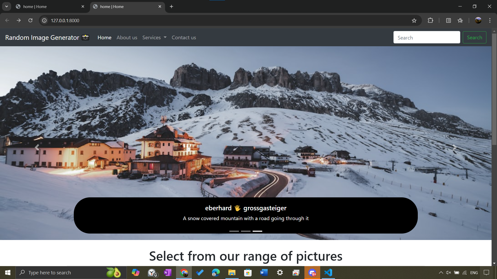

# Random Image Generator with Django 🎨📸

## Project Overview

Welcome to the **Random Image Generator with Django 🎨📸**! This project is designed to fetch and display random images using the Django framework. Whether you're looking to add a touch of randomness to your website or just enjoy the fun of seeing different images each time, this project has got you covered.

## contact management system image

## Getting Started

### Prerequisites

Before you begin, ensure you have met the following requirements:
- Python 3.x installed on your machine
- Django installed (`pip install django`)
- Basic knowledge of Django and Python

API Integration
The project integrates with the Unsplash API to fetch and display random images. Ensure you have an API key from Unsplash and configure it in your Django settings.
